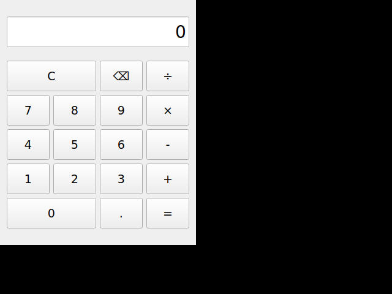

# Qt Calculator (計算機)

A basic calculator application built with Qt5 featuring:



## Features
- **Display Screen**: Large display with right-aligned text input
- **Number Buttons**: 0-9 digits and decimal point
- **Basic Operations**:
  - Addition (+)
  - Subtraction (-)
  - Multiplication (×)
  - Division (÷)
- **Function Buttons**:
  - Equals (=) - Calculate result
  - Clear (C) - Reset calculator
  - Delete (⌫) - Remove last digit
- **Error Handling**: Division by zero protection

## Requirements
- Qt5 (qt5-qmake, qtbase5-dev)
- C++ compiler (g++)
- make

## Building

### Install Dependencies (Ubuntu/Debian)
```bash
sudo apt-get install qt5-qmake qtbase5-dev build-essential
```

### Build the Calculator
```bash
qmake calculator.pro
make
```

## Running
```bash
./calculator
```

## Layout
The calculator features a 4×4 button grid with a display screen on top:
```
┌─────────────────────────┐
│      Display (0)        │
├─────┬─────┬─────┬─────┤
│  C  │  C  │  ⌫  │  ÷  │
├─────┼─────┼─────┼─────┤
│  7  │  8  │  9  │  ×  │
├─────┼─────┼─────┼─────┤
│  4  │  5  │  6  │  -  │
├─────┼─────┼─────┼─────┤
│  1  │  2  │  3  │  +  │
├─────┼─────┼─────┼─────┤
│   0     │  .  │  =  │
└─────────┴─────┴─────┘
```

## Usage
1. Click number buttons to enter digits
2. Click an operation button (+, -, ×, ÷)
3. Enter the second number
4. Click equals (=) to see the result
5. Use Clear (C) to reset or Delete (⌫) to remove the last digit

## License
Open source project